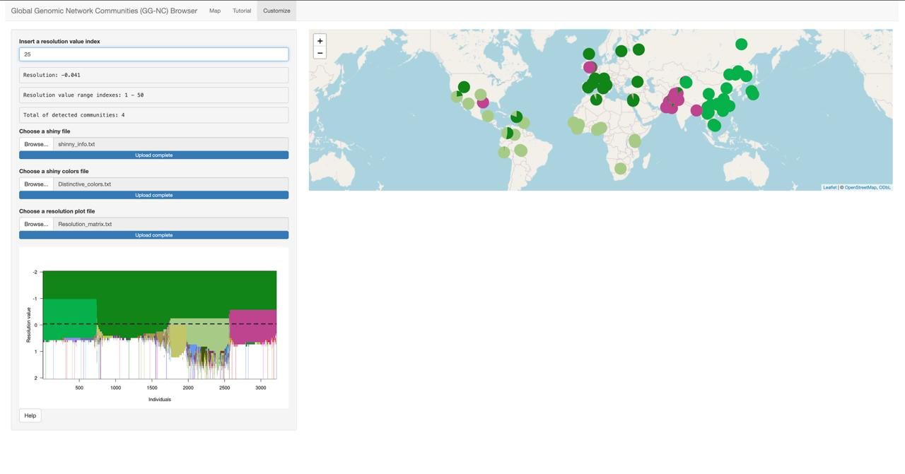

## Global Genomic Network Communities (GG-NC) Browser

This GitHub page contains the code, input data and the wrapper to run the Shiny app for the [Global Genomic Network Communities Browser](https://sohail-lab.shinyapps.io/GG-NC/) developed by the [Sohail Lab](https://www.sohaillab.com/) at the Center for Genomic Sciences - UNAM, financed by Conahcyt.

Input data are obtained from the [1000 Genomes Project](https://www.nature.com/articles/nature15393) and [Human Genome Diversity Project](https://www.science.org/doi/10.1126/science.aay5012?url_ver=Z39.88-2003&rfr_id=ori:rid:crossref.org&rfr_dat=cr_pub%20%200pubmed).

The Shiny app, was developed within the research titled "Beyond Continental Groups for Framing Human Diversity: shifting from Static Clusters to Dynamic Communities in Genetic Networks", aims to make the results of this research more interactive and allow engagement from the community of scientists and the general public alike. This Shiny app allows you to view the different communities that emerge at different resolution values and their geographic distribution considering different genetic metrics (Genetic Relationship Matrix based on common or rare variants, Identity By Descent and Principal Component Analysis)  

## Shiny interface
Follow [this link](https://sohail-lab.shinyapps.io/GG-NC/) for the interactive Shiny app. A screenshot of the interface is provided below.


The Shiny app contains a toolbar with the following options:

+ __Select a genetic metric__: You can choose one of the provided genetic metrics: Genetic Relationship Matrix (GRM) for rare or common variants, Identity by Descent (IBD) or Principal Component Analysis (PCA).

+ __Select a cohort__: Choose a cohort from either the 1000 Genomes Project or the Human Genome Diversity Project.

+ __Select a resolution value__: Select one of the 50 resolution values. The resolution values span a logarithmic space from -2 to 2.

As a result of setting the previous options, you will obtain: 

+ __Resolution plot__: This plot displays the identified communities at various resolution values by genetic metric. At the bottom of the app you can activate the option "Similar colors" which enable communities of greater similarity (in a genetic sense) to be represented with more similar colors, promoting visual coherence. 

+ __Map__: In this map, cohorts are spatially linked to their respective sampling locations. Each pie chart corresponds to a cohort sourced from either the 1000 Genomes Project or The Human Genome Diversity Project.

+ __Pie chart__: The pie chart illustrates the distribution of individuals within a chosen cohort across various network communities.

+ __Community network__: This 3D interactive network is constructed by averaging the positions of individuals within each community in the network of individuals. The node sizes are proportional to the respective community sizes. Edges indicate the density of connections between these communities. You can move it to view different angles.

Note that colors in the resolution plot correspond to those displayed in the accompanying map.

At the top of the browser, you will find two additional tabs. The first tab, labeled __"Tutorial"__, contains a [tutorial video](https://www.youtube.com/watch?v=2bdod1RuRVk) created by the research team, which guides you through using this tool and interpreting the results. This video is also available in [Spanish](https://www.youtube.com/watch?v=mVegRKbWSAI&t=105s). The second tab, labeled __"Customize"__, provides an option for users to tailor the tool according to their needs or preferences. This option is described at the end of this document.

## Docker

A Docker image is available to simplify the setup and ensure compatibility with all dependencies. You can pull the image using the following command:

```bash
## Pull the image
docker pull mpalmamtz/ggnc:1.0

## Run the Docker container

docker run --rm -it -v $(pwd):/workspace mpalmamtz/ggnc:1.0

### EXAMPLE for demo data

./Parameters_GGNC.sh -k IBD -p /workspace/ -d autosomal_ibd_by_pair.columns.20150206.txt -i /info_file_1000G.txt -m 1000000 -s 10 -l RIndex.txt -u 0 -c 6 -a -2 -z 1 -r 123

```
The Docker image (mpalmamtz/ggnc:1.0) was pulled in 13.102 seconds:

User time: 0.11s
System time: 0.12s
CPU usage: 1%


Runtime for example for Demodata on iMac (Apple M1, 8 cores, 16 GB RAM, macOS Sonoma 14.2.1):

Real: 14m57.774s
User: 33m16.718s
Sys: 0m18.289s.32

The pipeline has been tested on 

CentOS Linux release 6.9 and Ubuntu 22.04.4 LTS

## Version and libraries
The pipeline was built in R4.2.2, using the following packages: 
+ rgl v(1.2.8)
+ chameleon (v0.2-3)
+ aricode (v1.0.2)
+ ggplot2 (v3.4.3)
+ dplyr (v1.1.3)
+ pracma (v2.4.2)
+ doParallel (v1.0.17)
+ iterators (v1.0.14)
+ foreach (v1.5.2)
+ igraph (v1.5.1)
+ ComplexHeatmap (v2.14.0).

The Shiny app was built in R4.2.2, using the following packages:

+ shiny (v1.8.0)
+ shinytitle (v0.1.0)
+ pracma (v2.4.4)
+ leaflet (v2.2.1)
+ plotly (v4.10.3)
+ bslib (v0.5.1)
+ igraph (v1.5.1)
+ shinyalert (v3.0.0)
+ shinyWidgets (v0.8.0)
+ shinyBS (v0.61.1)
+ rgl (v1.2.8)
+ shinyscreenshot (v0.2.1)
+ DescTools (v0.99.54)
+ vembedr (v0.1.5)
+ leaflet.minicharts (v0.6.2)


## Run the pipeline on the command-line

+ __Clone the repository__: First, you need to clone the GitHub repository. You can do this by using the __'git clone'__ command.
  <center>
    
  For example:
```
  git clone https://github.com/mariajpalma/GG-NC.git
 ``` 
  </center>
  
+ __Change to the newly cloned directory__: Once the repository is cloned, access the directory that was created during cloning using the __'cd'__ command.
  <center>
```    
  cd GG-NC
```  
  </center>

 + __Execute the '.sh' file__: Once you are in the repository directory, you can execute the __'.sh'__ file using the __'bash'__ command followed by the file name and the necessary parameters. You can see the required parameters in the ParametersV011223.sh file.
   <center>
    
  For example:
```
  bash ParametersV011223.sh -k <param1> -p <param2> -d <param3> -i <param4> -m <param5> -s <param6> -l <param7> -u <param8> -c <param9> -a <param10> -z <param11> [-L]
 ```
 Where each parameter refers to: 
 
 -k \<param1\>:   The genetic metric to consider. Kind: IBD, PCA or GRM.
 
 -p \<param2\>:   Path of your files.
 
 -d \<param3\>:   Name of your IBD/PCA/GRM files.
 
 -i \<param4\>:    Name of your metadata file. In this file, it is expected to find information about the proposed grouping for your samples.
 
 -m \<param5\>:   Maximum value of the sum of the length of the IBD segments to be allowed.
 
 -s \<param6\>:   Steps in the log10 space to explore.
 
 -l \<param7\>:   This is a file with the indexes of the resolution levels that will be used to generate the heatmaps and the networks of individuals with shaded communities. For example: 1, 2, 5, ...
 
 -u \<param8\>:   Prune option.
 
 -c \<param9\>:   Minimun individuals in a community.
 
 -a \<param10\>:  Lower limit of the log10 space to explore.
 
 -z \<param11\>:  Upper limit of the log10 space to explore.
 
 -r \<param12\>:  Set random seed.
 
 -L            :  This parameter is optional: use the Leiden algorithm instead of the Louvain algorithm.


 
 

   </center>

**Format of IBD/PCA/GRM Input Files:** 

**IBD:** The pipeline expects a three-column file with tab-separated values for IBD analysis. The first and second columns should correspond to the ID, and the third column should represent the sum of IBD segments.

|ID1	    |ID2	    |IBD_CM_SUM       |
|---------|---------|-----------------|
|HGDP00382|HGDP00397|5.72952          |
|HGDP00995|HGDP01019|973.6069399999999|
|HG01269	|HG01468	|111.25585        |
|HGDP00557|HGDP00565|380.715259999999 |

**PCA:** For PCA analysis, the input file should be tabulated with the first column representing the ID, and the subsequent columns (from the second column onwards) should correspond to the PCA values. You can use as many PCs as you want.

|indv	  |PC1       |PC2       |PC3       |PC4       |PC5	      |PC6	      |PC7	      |PC8	     |PC9	      |PC10       |
|-------|----------|----------|----------|----------|-----------|-----------|-----------|----------|----------|-----------|
|HG00096|	-0.12578 |-0.24774  |-0.019454 |0.084224	|-0.011884  |-0.0012548	|-0.060939	|-0.018647 |-0.0017283|0.0063747  |
|HG00097|	-0.126   |-0.24707  |-0.017057 |0.086622	|-0.010138  |0.005294	  |-0.059246	|-0.017177 |-0.0032765|-0.003018  |
|HG00099|	-0.12443 |-0.24729  |-0.022543 |0.081816	|-0.0082434 |0.0018152	|-0.062343	|-0.01951	 |-0.0023126|-0.0025261 |


**GRM:** To estimate the genetic relationship matrix (GRM), we utilized the [GCTA-GRM](https://gcta.freeforums.net/thread/175/gcta-estimating-genetic-relationship-using) tool, and the pipeline anticipates the presence of .bin and .id files only.

With these steps, you should be able to run the shell script found in the GitHub repository from your system terminal. Remember that you will need to have Git installed on your system to clone the repository from GitHub.

Format of 
   
 + Make sure to replace \<paramX_value\> with the specific values you want to pass as arguments to the script.
 
  For example:
```
  bash ParametersV011223.sh -k IBD -p /path/to/files -d data_file_name -i info_file_name -m 100 -s 5 -l 0.5 -n shiny_info_file
 ``` 
   </center>

## Pipeline outputs

The pipeline outputs are organized into folders, which are described below.

1. __Browser_files__: Contains the text files required to display the results in the browser (these files are described in the "Customization Option" section). Other color alternatives for the resulting communities are also included.
   
   •	__Distinctive_colors.txt__: Contains the color codes for the resulting communities for the distinctive colors option.

   •	__Resolution_matrix.txt__: This file contains a matrix processed from the matrix "Result_matrix_relabeled_allcomm.txt", where each column represents an individual and each row represents a resolution value (50 values). Individuals are sorted to group those belonging to the same communities and very small communities have been combined (according to the -c parameter).
   
   •	__Similar_colors.txt__: Contains the color codes for the resulting communities for the similar colors option, where communities that are more genetically similar to each other receive more similar colors.

   •	__alternative_colors_1.txt__: First option of alternative colors.

   •	__alternative_colors_2.txt__: Second option of alternative colors.

   •	__shinny_info.txt__: This text file contains information about the cohorts considered in the analysis. Here, you can find the population name (Pop), the three-letter code for the population (Pop3code), the geographic region where the population is located (Genetic_region), the project from which the genetic information was obtained (Project), the latitude (Latitud) and longitude (Longitud) of the population's geographic location, the resolution level (Lambda), and the communities (C#) identified in the network. Within the communities, you can find estimates of the proportion of the population present in each one.

|Pop	                     |Pop3code|Genetic_region|Project|Latitud|Longitud|Lambda	            |C2|C3|C4|C5|
|--------------------------|--------|--------------|-------|-------|--------|-------------------|--|--|--|--|
|Adygei in Caucasus, Russia|ADR     |EUR	         |HGDP	 |44	   |39	    |0.001	            |1 |NA|NA|NA|
|Adygei in Caucasus, Russia|ADR	    |EUR	         |HGDP	 |44	   |39	    |0.00115139539932645|1 |NA|NA|NA|
|Adygei in Caucasus, Russia|ADR	    |EUR	         |HGDP	 |44	   |39	    |0.00132571136559011|1 |NA|NA|NA|
   
2. __Community_detection__: Includes text files containing the resulting matrices and their visual representation, listed below.

   • __Result_matrix_raw.txt__: Is a numerical matrix that presents the community classification of individuals promptly following their processing through either the Louvain algorithm at various resolution values. Communities do not align across resolutions, so this matrix requires further processing.

   • __Result_matrix_relabeled_allcomm.txt__: This is the matrix after processing the "Result_matrix_raw.txt" to ensure that the communities are consistent across resolutions.

   • __individual_index_order.txt__: It is the new order of individuals after processing the "Result_matrix_raw.txt".

   • __res_plot.png__: Graphically represents the emergence of communities, colored with distinctive colors, as identified by the algorithm across varying resolution values.

   • __resolution_plot_similarC.png__: Graphically represent the emergence of communities as shown in "res_plot.png" using similar color gradients that resemble the genetic similarity between individuals across varying resolution values.

3. __Community_networks__: This folder contains community networks images as well as the objects needed for 3D visualization.
   
   • __3Dplots_distinctive.rds__: This file contains a 3D community network, with each community rendered in a distinctive color corresponding to their designated community.

   • __3Dplots_similar.rds__: This file contains a 3D community network, with each community rendered in a similar color option corresponding to their designated community.

   • __CommunityNetworks_2D_DistinctiveC_RIndex#.png__: They are 2D community networks with distinctive colors, one for each resolution level (#).

   • __CommunityNetworks_2D_DistinctiveC_whiteComm_RIndex#.png__: They are 2D community networks with distinctive colors, one for each resolution level (#). Unlike the previous ones, these networks, if they are present, show the "white communities" which consist of aggregations of smaller communities (according to the -c parameter).

   • __CommunityNetworks_2D_SimilarC_RIndex#.png__: They are 2D community networks with similar colors option, one for each resolution level (#).

   • __CommunityNetworks_2D_SimilarC_whiteComm_RIndex#.png__: They are 2D community networks with similar colors option, one network for each resolution level (#). Unlike the previous ones, these networks, if they are present, show the "white communities" which consist of aggregations of smaller communities (according to the -c parameter).
   
4. __NetworksIndividuals__: Includes the images of individual networks.
   
   • __Network_Individuals_Communities_DistinctiveColors_RIndex#.png__: They are 2D networks where each node represents an individual rendered in a distinctive color corresponding to their designated community formed at a given resolution level (#).

    • __Network_Individuals_Communities_DistinctiveColors_legend.png__: Contains a unique legend for all individual networks with community color coding.

   • __Network_Individuals_Communities_DistinctiveColors_whiteComm_RIndex#.png__: They are 2D networks where each node represents an individual rendered in a distinctive color corresponding to their designated community formed at a given resolution level (#). Unlike the previous ones, these networks, if they are present, show the individuals in the "white communities", which consist of aggregations of smaller communities (according to the -c parameter).

   • __Network_Individuals_Communities_SimilarColors_RIndex#.png__: They are 2D networks at a given resolution level (#), where each node represents an individual rendered in a similar color gradients that resemble the genetic similarity between individuals across varying resolution values.

   • __Network_Individuals_Communities_whiteComm_SimilarColors_RIndex#.png__: They are 2D networks at a given resolution level (#), where each node represents an individual rendered in a similar color gradients that resemble the genetic similarity between individuals across varying resolution values. Unlike the previous ones, these networks, if they are present, show the individuals in the "white communities", which consist of aggregations of smaller communities (according to the -c parameter).
   
   • __Network_individuals_PredefinedGroups.png__: Is a 2D network where each node represents an individual rendered in a color corresponding to their respective continental or sub-continental geographic location annotated in the 1000 Genomes and HGDP studies.

5. __Stability_metrics__: This folder contains stability plots using ARI and NID, as well as text files to perform common membership heatmaps across different resolutions, along with the heatmaps themselves for the specified values.

   • __Common_membership_file_R__: Is an matrix with the membership for the resolution "R" to store the number of times each pair of individuals shares the same cluster.
   
   • __Stability_ARI_bloxplot.png__: Boxplots of pairwise estimates of Adjusted Rand Index (ARI) values for 100 runs for each resolution value using the algorithm for community detection, along with boxplots when assumed continental-level clustering.
   
   • __Stability_ARI_mean.png__: A dot plot showing the mean of the pairwise estimates of Adjusted Rand Index (ARI) values for 100 runs for each resolution value using the algorithm for community detection.
   
   • __Stability_ARI_median.png__: A dot plot showing the median of the pairwise estimates of Adjusted Rand Index (ARI) values for 100 runs at each resolution value.
   
   • __Stability_ARI_variance.png__: A dot plot showing the variance of the pairwise estimates of Adjusted Rand Index (ARI) values for 100 runs at each resolution value.

   • __Stability_NID_bloxplot.png__: Boxplots of pairwise estimates of Normalized Information Distance (NID) values for 100 runs for each resolution value using the algorithm for community detection, along with boxplots when assumed continental-level clustering.
   
   • __Stability_NID_mean.png__: A dot plot showing the mean of the pairwise estimates of Normalized Information Distance (NID) values for 100 runs at each resolution value.
   
   • __Stability_NID_median.png__: A dot plot showing the median of the pairwise estimates of Normalized Information Distance (NID)) values for 100 runs at each resolution value.
   
   • __Stability_NID_variance.png__: A dot plot showing the variance of the pairwise estimates of Normalized Information Distance (NID) values for 100 runs at each resolution value.
   
## Customization Option
The GG-NC browser also offers a customization option based on the user's needs or preferences (a screenshot of the customization option interface is provided below). For this, the user must set a resolution value index, which corresponds to the number of steps within the resolution range that spans from 1 to 50. Then, it is necessary to upload three text files, which are described below.



### Shiny info file

This text file contains information about the cohorts considered in the analysis. The columns include: 

|Pop	                     |Pop3code|Genetic_region|Project|Latitud|Longitud|Lambda	            |C2|C3|C4|C5|
|--------------------------|--------|--------------|-------|-------|--------|-------------------|--|--|--|--|
|Adygei in Caucasus, Russia|ADR     |EUR	         |HGDP	 |44	   |39	    |0.001	            |1 |NA|NA|NA|
|Adygei in Caucasus, Russia|ADR	    |EUR	         |HGDP	 |44	   |39	    |0.00115139539932645|1 |NA|NA|NA|
|Adygei in Caucasus, Russia|ADR	    |EUR	         |HGDP	 |44	   |39	    |0.00132571136559011|1 |NA|NA|NA|

•	__Pop__: Names of the cohorts (e.g., Adygei in Caucasus, Russia; Bengali in Bangladesh).

•	__Pop3code__: Three-letter identifiers for each cohort (e.g., ADR for Adygei, BEB for Bengali).

•	__Genetic_region__: Three-letter continental region codes (e.g., EUR for Europe, CSA for Central South Asia).

•	__Project__: Dataset names (e.g., HGDP, 1000 Genomes).

•	__Latitud__ and __Longitud__: Geographic coordinates (latitude and longitude) provided by the 1000 Genomes Project and HGDP.

•	__Lambda__: Represents the resolution values considered for exploration in the analysis for each population.

•	__C1__ to __Cn__: Proportion of individuals from the cohort within each community (expressed in decimals) according to the analyzed resolution value; missing values are indicated as NA.

Note that each population spans 50 rows due to the 50 resolution values analyzed in this research.

### Shiny colors file

The second text file contains the color codes for the resulting communities. It consists of a single column without a header. If you wish to use the similar colors option, you should use a shiny color file that contains the codes for the similar colors. Below is an example of a shiny colors file.

|       |
|-------|
|#FFFFFF|
|#8F71F9|
|#4D966F|
|#3B9B3D|
|#721BA5|

### Resolution plot file 

This file contains a matrix where each column represents an individual and each row represents a resolution value (50 values). In other words, each cell in the matrix would indicate which community a specific individual belongs to for a particular resolution value. For example, if we analyze 1,500 individuals then we will have a 50x1500 matrix. Keep in mind that the values within the matrix should be separated by commas.

The [data](data)  folder contains the required inputs to perform some examples included in the paper using the customize option.

## Demo

## Pipeline Workflow

<iframe width="768" height="432" src="https://miro.com/app/live-embed/uXjVKozyEjI=/?moveToViewport=-14098,-2118,37698,19684&embedId=389371771141" frameborder="0" scrolling="no" allow="fullscreen; clipboard-read; clipboard-write" allowfullscreen></iframe>

## Authors 

María J. Palma, Centro de Ciencias Genómicas, UNAM, Cuernavaca, México.

Yuridia S. Posadas-García, Centro de Ciencias Genómicas, UNAM, Cuernavaca, México.

Claudia Quiroz, Escuela Nacional de Antropología e Historia, CDMX, México.

Brenda E. López, Centro de Ciencias Genómicas, UNAM, Cuernavaca, México. 

Anna Lewis, E J Safra Center for Ethics, Harvard University, Cambridge, MA.

Tina Lasisi, Univ. of Michigan, Ann Arbor, MI.

Kevin A. Bird, Univ. of California, Davis, Davis, CA.

Arslan Zaidi, Department of Genetics, cell biology, and Development, University of Minnesota, Twin Cities, MN/ Institute of Health Informatics, University of Minnesota, Twin Cities, MN.

Mashaal Sohail, Centro de Ciencias Genómicas, UNAM, Cuernavaca, México.

## License
This project is covered under the __Apache 2.0 License__.

## Contact

mashaal@ccg.unam.mx
