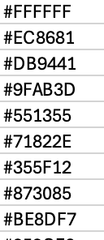

## Global Genomic Network Communities (GG-NC) Browser

This GitHub page contains the code, input data and the wrapper to run the Shiny app for the [Global Genomic Network Communities Browser](https://sohail-lab.shinyapps.io/GG-NC/) developed by the [Sohail Lab](https://www.sohaillab.com/) at the Center for Genomic Sciences - UNAM, financed by Conahcyt.

Input data are obtained from the [1000 Genomes Project](https://www.nature.com/articles/nature15393) and [Human Genome Diversity Project](https://www.science.org/doi/10.1126/science.aay5012?url_ver=Z39.88-2003&rfr_id=ori:rid:crossref.org&rfr_dat=cr_pub%20%200pubmed).

The Shiny app, was developed within the research titled "Beyond Continental Groups for Framing Human Diversity: shifting from Static Clusters to Dynamic Communities in Genetic Networks", aims to make the results of this research more interactive and allow engagement from the community of scientists and the general public alike. This Shiny app allows you to view the different communities that emerge at different resolution values and their geographic distribution considering different genetic metrics (Genetic Relationship Matrix based on common or rare variants, Identity By Descent and Principal Component Analysis)  

## Shiny interface
Follow [this link](https://sohail-lab.shinyapps.io/GG-NC/) for the interactive Shiny app. A screenshot of the interface is provided below.


The Shiny app contains a toolbar with the following options:

+ __Select a genetic metric__: You can choose one of the provided genetic metrics: Genetic Relationship Matrix (GRM) for rare or common variants, Identity by Descent (IBD) or Principal Component Analysis (PCA).

+ __Select a cohort__: Choose a cohort from either the 1000 Genomes Project or the Human Genome Diversity Project.

+ __Select a resolution value__: Select one of the 50 resolution values. The resolution values span a logarithmic space from -2 to 2.

As a result of setting the previous options, you will obtain: 

+ __Resolution plot__: This plot displays the identified communities at various resolution values by genetic metric. At the bottom of the app you can activate the option "Similar colors" which enable communities of greater similarity (in a genetic sense) to be represented with more similar colors, promoting visual coherence. 

+ __Map__: In this map, cohorts are spatially linked to their respective sampling locations. Each pie chart corresponds to a cohort sourced from either the 1000 Genomes Project or The Human Genome Diversity Project.

+ __Pie chart__: The pie chart illustrates the distribution of individuals within a chosen cohort across various network communities.

+ __Community network__: This network is constructed by averaging the positions of individuals within each community in the network of individuals. The node sizes are proportional to the respective community sizes. Edges indicate the density of connections between these communities.

Note that colors in the resolution plot correspond to those displayed in the accompanying map.

At the top of the browser, you will find two additional tabs. The first tab, labeled __"Tutorial"__, contains a [tutorial video](https://www.youtube.com/watch?v=2bdod1RuRVk) created by the research team, which guides you through using this tool and interpreting the results. This video is also available in [Spanish](https://www.youtube.com/watch?v=mVegRKbWSAI&t=105s). The second tab, labeled __"Customize"__, provides an option for users to tailor the tool according to their needs or preferences. This option is described at the end of this document.

## Run the pipeline on the command-line

+ __Clone the repository__: First, you need to clone the GitHub repository. You can do this by using the __'git clone'__ command.
  <center>
    
  For example:
```
  git clone https://github.com/mariajpalma/GG-NC.git
 ``` 
  </center>
  
+ __Change to the newly cloned directory__: Once the repository is cloned, access the directory that was created during cloning using the __'cd'__ command.
  <center>
```    
  cd GG-NC
```  
  </center>

 + __Execute the '.sh' file__: Once you are in the repository directory, you can execute the __'.sh'__ file using the __'bash'__ command followed by the file name and the necessary parameters. You can see the required parameters in the ParametersV011223.sh file.
   <center>
    
  For example:
```
  bash ParametersV011223.sh -k <param1_value> -p <param2_value> -d <param3_value> -i <param4_value> -m <param5_value> -s <param6_value> -l <param7_value> -n <param8_value>
 ```
 Where each parameter refers to: 
 
 -k \<param1\>:   The genetic metric to consider. Kind: IBD, PCA or GRM
 
 -p \<param2\>:   Path of your files
 
 -d \<param3\>:   Name of your IBD/PCA/GRM files
 
 -i \<param4\>:    Name of your metadata file. In this file, it is expected to find information about the proposed grouping for your samples.
 
 -m \<param5\>:   Maximum value of the sum of the length of the IBD segments to be allowed.
 
 -s \<param6\>:   Number of steps inside lambda range
 
 -l \<param7\>:   Lambda value to explore 
 
 -n \<param8\>:   Metadata file to generate shiny input

 -w \<param9\>:   Minimum size of the communities to be labeled and colored
 

   </center>

**Format of IBD/PCA/GRM Input Files:** 

**IBD:** The pipeline expects a three-column file with tab-separated values for IBD analysis. The first and second columns should correspond to the ID, and the third column should represent the sum of IBD segments.

**PCA:** For PCA analysis, the input file should be tabulated with the first column representing the ID, and the subsequent columns (from the second column onwards) should correspond to the PCA values.

**GRM:** To estimate the genetic relationship matrix (GRM), we utilized the [GCTA-GRM](https://gcta.freeforums.net/thread/175/gcta-estimating-genetic-relationship-using) tool, and the pipeline anticipates the presence of .bin and .id files only.

With these steps, you should be able to run the shell script found in the GitHub repository from your system terminal. Remember that you will need to have Git installed on your system to clone the repository from GitHub.

Format of 
   
 + Make sure to replace \<paramX_value\> with the specific values you want to pass as arguments to the script.
 
  For example:
```
  bash ParametersV011223.sh -k IBD -p /path/to/files -d data_file_name -i info_file_name -m 100 -s 5 -l 0.5 -n shiny_info_file
 ``` 
   </center>
   
## Customization Option
The GG-NC browser also offers a customization option based on the user's needs or preferences. For this, the user must set a resolution value index, which corresponds to the number of steps within the resolution range that spans from 1 to 50. Then, it is necessary to upload three text files, which are described below.


### Shiny info file

This text file contains information about the cohorts considered in the analysis. The columns include: 


•	__Pop__: Names of the cohorts (e.g., Adygei in Caucasus, Russia; Bengali in Bangladesh).

•	__Pop3code__: Three-letter identifiers for each cohort (e.g., ADR for Adygei, BEB for Bengali).

•	__Genetic_region__: Three-letter continental region codes (e.g., EUR for Europe, CSA for Central South Asia).

•	__Project__: Dataset names (e.g., HGDP, 1000 Genomes).

•	__Latitud__ and __Longitud__: Geographic coordinates (latitude and longitude) provided by the 1000 Genomes Project and HGDP.

•	__Lambda__: 50 lambda values considered in the analysis.

•	__C1__ to __Cn__: Proportion of individuals from the cohort within each community (expressed in decimals) according to the analyzed lambda value; missing values are indicated as NA.

Note that each population spans 50 rows due to the 50 lambda values analyzed.

### Shiny colors file

The second text file contains the color codes for the resulting communities. It consists of a single column without a header. If you wish to use the similar colors option, you should use a shiny color file that contains the codes for the similar colors. Below is an example of a shiny colors file.

  

### Resolution plot file 

This file contains a matrix where each column represents an individual and each row represents a resolution value (50 values). In other words, each cell in the matrix would indicate which community a specific individual belongs to for a particular resolution value. For example, if we analyze 1,500 individuals then we will have a 50x1500 matrix. Keep in mind that the values within the matrix should be separated by commas.

The [data](data)  folder contains the required inputs to perform some examples included in the paper using the customize option.


## Authors 

María J. Palma, Centro de Ciencias Genómicas, UNAM, Cuernavaca, México.

Yuridia S. Posadas-García, Centro de Ciencias Genómicas, UNAM, Cuernavaca, México.

Claudia Quiroz, Escuela Nacional de Antropología e Historia, CDMX, México.

Brenda E. López, Centro de Ciencias Genómicas, UNAM, Cuernavaca, México. 

Anna Lewis, E J Safra Center for Ethics, Harvard University, Cambridge, MA.

Tina Lasisi, Univ. of Michigan, Ann Arbor, MI.

Kevin A. Bird, Univ. of California, Davis, Davis, CA.

Arslan Zaidi, Department of Genetics, cell biology, and Development, University of Minnesota, Twin Cities, MN/ Institute of Health Informatics, University of Minnesota, Twin Cities, MN.

Mashaal Sohail, Centro de Ciencias Genómicas, UNAM, Cuernavaca, México.

## Contact

mashaal@ccg.unam.mx
